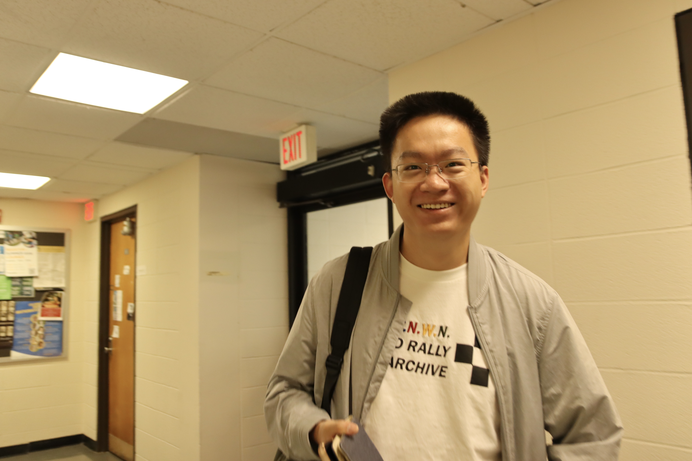

Here is the math page for Chengyang Wu.

## About me:

I am currently a fifth-year Ph.D. candidate at Peking University. I'm on market now!

Email: 
- chengyangwu1999@gmail.com
- chengyangwu@stu.pku.edu.cn

## Education Career:
- (2024.8-2025.2) Visiting Scholar, Department of Mathematics, Brandeis University. 
Co-advisor: [Dmitry Kleinbock](https://people.brandeis.edu/~kleinboc/).
- (2021.9-present) Ph.D. candidate, School of Mathematical Sciences, Peking University. 
Advisor: [Jinpeng An](https://www.math.pku.edu.cn/teachers/anjp/).
- (2017.9-2021.6) B.S., Department of Mathematics, Nanjing University. 
Thesis advisor: [Fuhai Zhu](https://math.nju.edu.cn/jzyg/apypl/20240321/i261793.html).
Thesis: [On a class of Frobenius Lie algebras (Chinese Version)](File/Undergraduate_Thesis.pdf).  

## Research Interests:

Lie groups, Homogeneous dynamical systems, and Diophantine approximations. 

## Papers in Preparation:
- (Joint work with [Pengyu Yang](http://www.mcm.ac.cn/people/members/202208/t20220831_645157.html)) _Equi-distribution for weighted expanding translates on analytic curves in SL_3(R)/SL_3(Z)_.
- (Joint work with [Jinpeng An](https://www.math.pku.edu.cn/teachers/anjp/) and [Sanju Velani]()) _Quantitative version of Schmidt's conjecture via a potential function method_.

## Preprints and Publications:
- (Joint work with [Dmitry Kleinbock](https://people.brandeis.edu/~kleinboc/)) _Simultaneously bounded and dense orbits for commuting Cartan actions_. (Submitted)
- (Joint work with [Lifan Guan](https://www.westlake.edu.cn/faculty/lifan-guan.html)) _Bounded geodesics on locally symmetric spaces_. (Submitted)
- (Joint work with [Danijela Damjanovic](https://www.kth.se/profile/ddam), [Amie Wilkinson](https://math.uchicago.edu/~wilkinso/), and [Disheng Xu](https://sites.google.com/view/dishengxu/homepage)) _The symmetries of affine K-systems and a program for centralizer rigidity_. (Submitted)
- (Joint work with Zichang Wang and [Bohan Yang](https://www.simis.cn/bohan-yang/)) _On identities concerning integer parts_, **Combinatorics and Number Theory**, 13-4 (2024), 317--332. DOI 10.2140/cnt.2024.13.317.

## Notes:
- _Margulis' and Littlewood's conjectures_.
- _Schmidt's game and winning sets_.
  

## Talks:
- (2024.10.14, New England Dynamics and Number Theory Seminar, invited by [Dmitry Kleinbock](https://people.brandeis.edu/~kleinboc/)) Title: _Simultaneously bounded and dense orbits for commuting Cartan actions_.
- (2024.9.23, Soochow Univeristy, invited by [Han Zhang](https://www.researchgate.net/profile/Han-Zhang-115)) Title: _Simultaneously bounded and dense orbits for commuting Cartan actions, and an application towards uniform Littlewood's conjecture_.
- (2025.9.17, Fudan University, invited by [Ronggang Shi](https://rgstone.github.io/)) Title: _Simultaneously bounded and dense orbits for commuting Cartan actions, and an application towards uniform Littlewood's conjecture_.
- (2025.8.10, TMSE, invited by [Weisheng Wu](https://math.xmu.edu.cn/info/1081/11192.htm)) Title: _The symmetries of affine K-systems and a program for centralizer rigidity_.
- (2025.7.23, SIMIS, invited by [Anurag Rao](https://sites.google.com/view/anuragraoswebsite/home)) Title: _Bounded geodesics on locally symmetric spaces and HAW properties_.
- (2025.5.28, Chinese Academy of Sciences, invited by [Pengyu Yang](http://www.mcm.ac.cn/people/members/202208/t20220831_645157.html)) Title: _The symmetries of affine K-systems and a program for centralizer rigidity_.
- (2025.4.26, Peking University Graduate Student Seminar) Title: _Bounded geodesics on locally symmetric spaces and HAW properties_.
- (2025.3.4, Nanjing University, invited by [Fuhai Zhu](https://math.nju.edu.cn/jzyg/apypl/20240321/i261793.html)) Title: _The symmetries of affine K-systems and a program for centralizer rigidity_.
- (2025.2.6, Brandeis Topological Seminar, invited by [Daniel Alvarez-Gavela](https://danielalvarezgavela.com/)) Title: _Bounded geodesics on locally symmetric spaces_.
- (2025.1.31, Tufts University, invited by [Boris Hasselblatt](https://facultyprofiles.tufts.edu/boris-hasselblatt)) Title: _Bounded geodesics on locally symmetric spaces_.
- (2025.1.13, Chicago University, invited by [Amie Wilkinson](https://math.uchicago.edu/~wilkinso/)) Title: _The symmetries of affine K-systems and a program for centralizer rigidity_.
- (2024.10.22, New England Dynamics and Number Theory Seminar, invited by [Dmitry Kleinbock](https://people.brandeis.edu/~kleinboc/)) Title: _Two-dimensional
quantitative Schmidt’s conjecture_.
- (2024.9.19, Brandeis Graduate Student Seminar) Title: _Stable ergodicity and centralizers_.
- (2024.8.6, Westlake University, invited by [Lifan Guan](https://www.westlake.edu.cn/faculty/lifan-guan.html)) Title: _Two-dimensional
quantitative Schmidt’s conjecture_.

## Reading Seminars:
- (2025 Spring, Chinese Academy of Sciences, organized by [Weikun He](http://homepage.amss.ac.cn/research/homePage/17902e3d211d45d7b099d774bbd98463/myHomePage.html) and [Pengyu Yang](http://www.mcm.ac.cn/people/members/202208/t20220831_645157.html)) Equi-distribution of A-periodic orbits on SL_2(R)/SL_2(Z) and Duke's theorem.
- (2025 Spring, Brandeis University, self-organized) Roy and Yuming's construction of templates in parametric geometry of numbers.
- (2024 Fall, Brandeis University, organized by Vasiliy Neckrasov) A variational principle in parametric geometry of numbers.
- (2023 Fall, Chinese Academy of Sciences, [Weikun He](http://homepage.amss.ac.cn/research/homePage/17902e3d211d45d7b099d774bbd98463/myHomePage.html) and [Pengyu Yang](http://www.mcm.ac.cn/people/members/202208/t20220831_645157.html)) A lemma of Einsiedler-Katok and its generalization in high entropy arguments.
- (2023 Summer, Peking University, organized by [Jinpeng An](https://www.math.pku.edu.cn/teachers/anjp/)) Proof of Ratner’s theorems using shearing property.
- (2023 Spring, Chinese Academy of Sciences, organized by [Weikun He](http://homepage.amss.ac.cn/research/homePage/17902e3d211d45d7b099d774bbd98463/myHomePage.html) and [Pengyu Yang](http://www.mcm.ac.cn/people/members/202208/t20220831_645157.html)) Geodesic submanifolds and properly supported measures in hyperbolic spaces.
- (2022 Fall, Chinese Academy of Sciences, organized by [Weikun He](http://homepage.amss.ac.cn/research/homePage/17902e3d211d45d7b099d774bbd98463/myHomePage.html) and [Pengyu Yang](http://www.mcm.ac.cn/people/members/202208/t20220831_645157.html)) From large dimension to effective density for the effective equi-distribution of unipotent flows.
- (2022 Spring, Peking University, organized by [Jinpeng An](https://www.math.pku.edu.cn/teachers/anjp/)) Measure rigidity and entropy methods for diagonal actions on homogeneous spaces.

## Teaching Experiences:

Here is a collection of [Teaching Materials](http://scholar.pku.edu.cn/chengyangwu/classes) for courses below. Some videoes are available at [Youtube Channel](https://www.youtube.com/@chengyangwu1999). 
- (2025 Spring) Linear Algebra A (II).
- (2024 Spring) Higher Algebra (II), Honors Class.
- (2023 Fall) Higher Algebra (I), Honors Class.
- (2023 Spring) Higher Algebra (II), Honors Class.
- (2022 Fall) Higher Algebra (I), Honors Class.
- (2022 Spring) Mathematical Analysis (II).
- (2021 Fall) Linear Algebra B.
