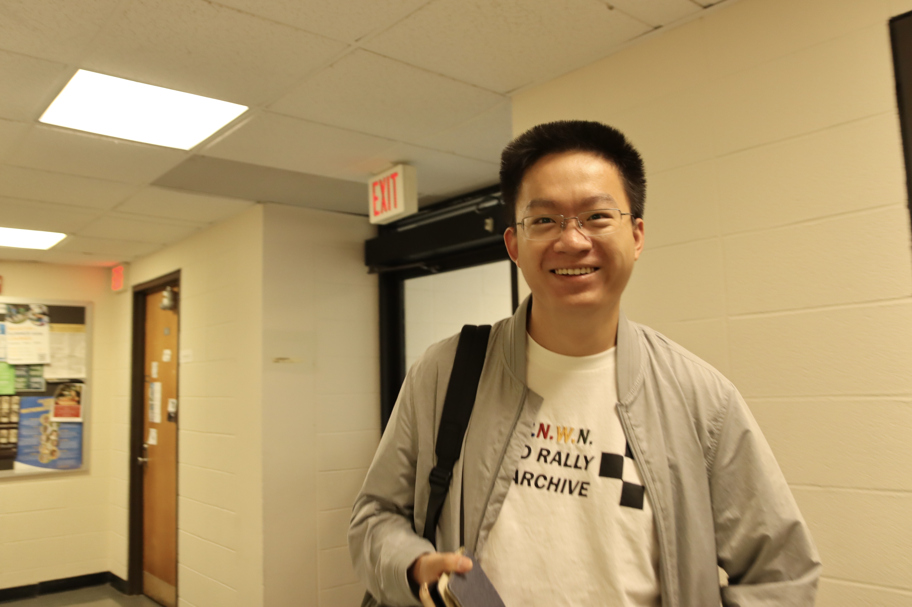

Here is the math page for Chengyang Wu.

<figure style="float: right; text-align: center; margin: -2.5em 0 1em 1em;">
  
  <figcaption style="margin-top: 0.5em;">Photographed by <a href="https://axhou.github.io/">Alan Hou</a>.</figcaption>
</figure>

<!-- <figure><figcaption>Photographed by Alan Hou.</figcaption></figure> -->

## One quotation: 

_Between midnight and dawn, when sleep will not come and all the old wounds begin to ache, I often have a nightmare vision of a future world in which there are billions of people, all numbered and registered, with not a gleam of genius anywhere, not an original mind, a rich personality, on the whole packed globe. The twin ideals of our time, organisation and quantity, will have won forever._ -- J. B. Priestley

## About me:

I am going to be a Dickson Instructor this fall at the Department of Mathematics, University of Chicago. 

Here is my [office location]() and my [colleagues](https://mathematics.uchicago.edu/people/#dickson-instructors).

My research interests include **Lie groups, homogeneous dynamical systems, and Diophantine approximations**. 

Email:
- chengyangwu1999@gmail.com
- chengyangwu@uchicago.edu

## Academic Appointments:
- (2026.9-present) Dickson Instructor, Department of Mathematics, University of Chicago. 
Research mentor: [Amie Wilkinson](https://math.uchicago.edu/~wilkinso/).

## Education Background:
- (2024.8-2025.2) Visiting Scholar, Department of Mathematics, Brandeis University. 
Co-advisor: [Dmitry Kleinbock](https://people.brandeis.edu/~kleinboc/).
- (2021.9-2026.6) Ph.D., School of Mathematical Sciences, Peking University. 
Advisor: [Jinpeng An](https://www.math.pku.edu.cn/teachers/anjp/).
Thesis: [A quantitative version of Schmidt's conjecture (Chinese version)]().  
Acknowledgement: [Acknowledgement in Ph.D. thesis (English version)]().
- (2017.9-2021.6) B.S., Department of Mathematics, Nanjing University. 
Thesis advisor: [Fuhai Zhu](https://math.nju.edu.cn/jzyg/apypl/20240321/i261793.html).
Thesis: [On a class of Frobenius Lie algebras (Chinese version)](File/Undergraduate_Thesis.pdf).  

## Papers in Preparation:
- (Joint work with [Pengyu Yang](http://www.mcm.ac.cn/people/members/202208/t20220831_1094331.html)) _Equi-distribution for weighted expanding translates on analytic curves in SL_3(R)/SL_3(Z)_.
- (Joint work with [Jinpeng An](https://www.math.pku.edu.cn/teachers/anjp/) and [Sanju Velani]()) _Quantitative version of Schmidt's conjecture via a potential function method_.

## Preprints and Publications:
- (Joint work with [Lifan Guan](https://www.westlake.edu.cn/faculty/lifan-guan.html)) _Singular points for cone actions on the product of certain homogeneous spaces_. (Submitted) [arxiv:2607.15669](https://arxiv.org/abs/2607.15669)
- (Joint work with [Dmitry Kleinbock](https://people.brandeis.edu/~kleinboc/)) _Simultaneously bounded and dense orbits for commuting Cartan actions_. (Submitted) [arxiv:2509.05272](https://arxiv.org/abs/2509.05272)
- (Joint work with [Danijela Damjanovic](https://www.kth.se/profile/ddam), [Amie Wilkinson](https://math.uchicago.edu/~wilkinso/), and [Disheng Xu](https://sites.google.com/view/dishengxu/homepage)) _The symmetries of affine K-systems and a program for centralizer rigidity_. (Submitted) [arxiv:2504.09084](https://arxiv.org/abs/2504.09084)
- (Joint work with [Lifan Guan](https://www.westlake.edu.cn/faculty/lifan-guan.html)) _Bounded geodesics on locally symmetric spaces_, **Ergodic Theory and Dynamical Systems** 46, no. 8 (2026): 1969–1993. [arxiv:2503.14007](https://arxiv.org/abs/2503.14007)
- (Joint work with Zichang Wang and [Bohan Yang](https://www.simis.cn/bohan-yang/)) _On identities concerning integer parts_, **Combinatorics and Number Theory**, 13-4 (2024), 317--332. [arxiv:2410.10402](https://arxiv.org/abs/2410.10402)

## Notes:
- _Probability theory and stochastic process_.
- _Margulis' and Littlewood's conjectures_.
- _Schmidt's game and winning sets_.

## Talks:
- (2026.4.24, Peking University Graduate Student Seminar) Title: _On ergodicity and symmetry for affine maps_.
- (2026.4.17, Chongqing University, invited by [Runlin Zhang](https://runlinzhang.github.io/)) Title: _A quantitative version of Schmidt's conjecture_.
- (2025.12.17, Peking University Graduate Student Seminar) Title: _A quantitative version of Schmidt's conjecture_.
- (2025.11.29, TMSE, invited by [Weisheng Wu](https://math.xmu.edu.cn/info/1081/11192.htm)) Title: _Topological rigidity and history of Margulis' conjecture_.
- (2025.10.14, New England Dynamics and Number Theory Seminar, invited by [Dmitry Kleinbock](https://people.brandeis.edu/~kleinboc/)) Title: _Simultaneously bounded and dense orbits for commuting Cartan actions_.
- (2025.9.23, Soochow Univeristy, invited by [Han Zhang](https://www.researchgate.net/profile/Han-Zhang-115)) Title: _Simultaneously bounded and dense orbits for commuting Cartan actions, and an application towards uniform Littlewood's conjecture_.
- (2025.9.17, Fudan University, invited by [Ronggang Shi](https://rgstone.github.io/)) Title: _Simultaneously bounded and dense orbits for commuting Cartan actions, and an application towards uniform Littlewood's conjecture_.
- (2025.8.10, TMSE, invited by [Weisheng Wu](https://math.xmu.edu.cn/info/1081/11192.htm)) Title: _The symmetries of affine K-systems and a program for centralizer rigidity_.
- (2025.7.23, SIMIS, invited by [Anurag Rao](https://sites.google.com/view/anuragraoswebsite/home)) Title: _Bounded geodesics on locally symmetric spaces and HAW properties_.
- (2025.5.28, Chinese Academy of Sciences, invited by [Pengyu Yang](http://www.mcm.ac.cn/people/members/202208/t20220831_645157.html)) Title: _The symmetries of affine K-systems and a program for centralizer rigidity_.
- (2025.4.26, Peking University Graduate Student Seminar) Title: _Bounded geodesics on locally symmetric spaces and HAW properties_.
- (2025.3.4, Nanjing University, invited by [Fuhai Zhu](https://math.nju.edu.cn/jzyg/apypl/20240321/i261793.html)) Title: _The symmetries of affine K-systems and a program for centralizer rigidity_.
- (2025.2.6, Brandeis Topological Seminar, invited by [Daniel Alvarez-Gavela](https://danielalvarezgavela.com/)) Title: _Bounded geodesics on locally symmetric spaces_.
- (2025.1.31, Tufts University, invited by [Boris Hasselblatt](https://facultyprofiles.tufts.edu/boris-hasselblatt)) Title: _Bounded geodesics on locally symmetric spaces_.
- (2025.1.13, Chicago University, invited by [Amie Wilkinson](https://math.uchicago.edu/~wilkinso/)) Title: _The symmetries of affine K-systems and a program for centralizer rigidity_.
- (2024.10.22, New England Dynamics and Number Theory Seminar, invited by [Dmitry Kleinbock](https://people.brandeis.edu/~kleinboc/)) Title: _Two-dimensional
quantitative Schmidt’s conjecture_.
- (2024.9.19, Brandeis Graduate Student Seminar) Title: _Stable ergodicity and centralizers_.
- (2024.8.6, Westlake University, invited by [Lifan Guan](https://www.westlake.edu.cn/faculty/lifan-guan.html)) Title: _Two-dimensional
quantitative Schmidt’s conjecture_.

## Teaching Experience:

Here is a collection of [Teaching Materials](File/LA_Notes_Chengyang_Wu.pdf) for courses below. Some videoes are available at [Youtube Channel](https://www.youtube.com/@chengyangwu1999). 
- (2025 Spring) Linear Algebra A (II).
- (2024 Spring) Higher Algebra (II), Honors Class.
- (2023 Fall) Higher Algebra (I), Honors Class.
- (2023 Spring) Higher Algebra (II), Honors Class.
- (2022 Fall) Higher Algebra (I), Honors Class.
- (2022 Spring) Mathematical Analysis (II).
- (2021 Fall) Linear Algebra B.
